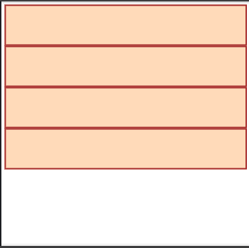
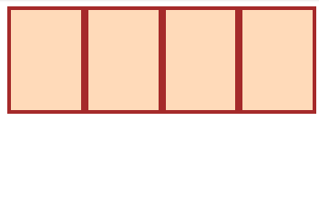
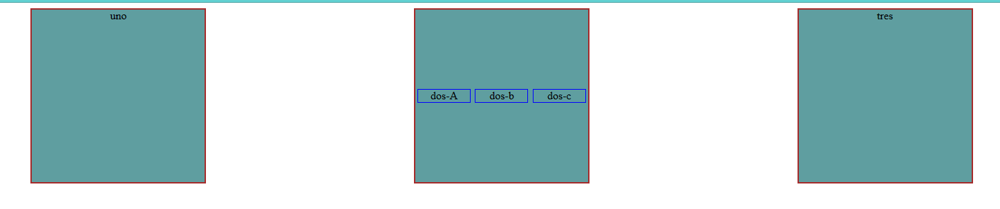
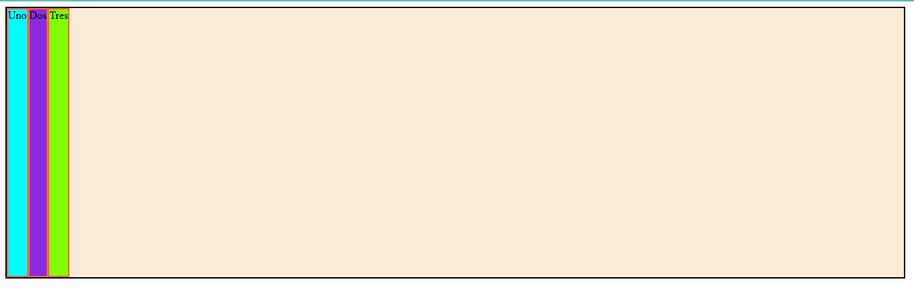
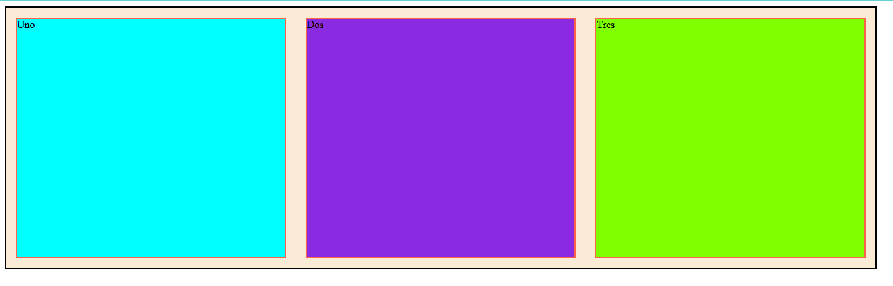
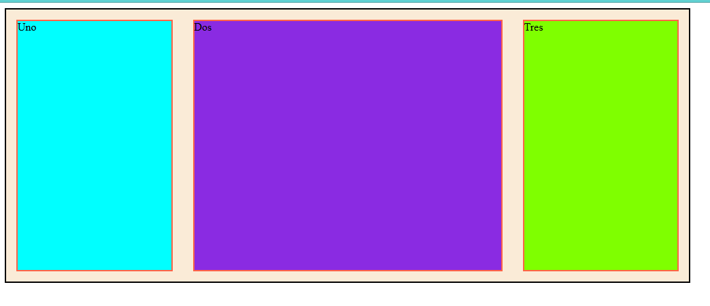
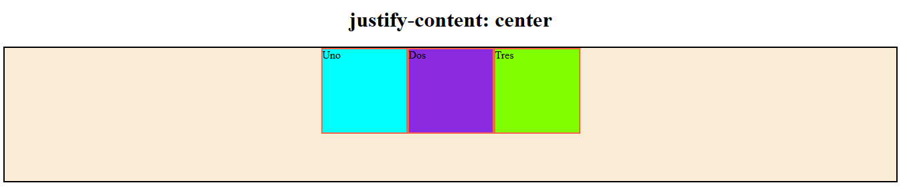
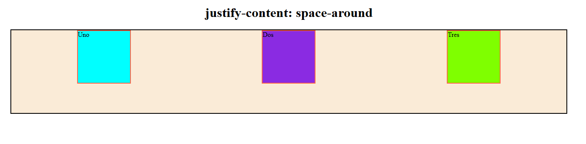
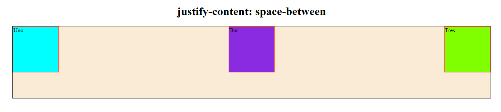
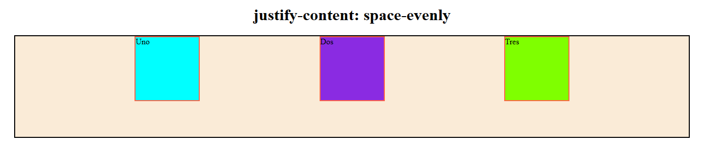

# Flex Box

Flex-box nos permitirá organizar las cajas horizontal y verticalmente.

Veamos este ejemplo:

```HTML
<div class="flex-container">
  <div class="one"></div>
  <div class="two"></div>
  <div class="three"></div>
  <div class="four"></div>
</div>
```

```CSS
.flex-container div {
  background: peachpuff;
  border: 4px solid brown;
  height: 100px;
}
```

En el navegador se observa lo siguiente:



Pero si agregamos la propiedad flex:

```CSS
.flex-container {
  display: flex;
}

/* this selector selects all divs inside of .flex-container */
.flex-container div {
  background: peachpuff;
  border: 4px solid brown;
  height: 100px;
  flex: 1
}
```

Las cajas se ordenarán horizontalmente, y ocuparan todo el ancho disponible.



Existe el contenedor con la propiedad flex, que dentro tiene los denominados items. A la vez una caja puede ser items y contenedor a la vez, por ejemplo:

```HTML
<style>
      .container {
        display: flex;
        text-align: center;
      }
      .hijo {
        width: 250px;
        height: 250px;
        background-color: cadetblue;
        border: 2px solid brown;
        margin: auto;
      }

      .hijo.div-dos {
        display: flex;
      }

      .hijito {
        border: 1px solid blue;
        margin: auto;
        width: 75px;
      }
    </style>
  </head>
  <body>
    <div class="container">
      <div class="hijo">uno</div>
      <div class="hijo div-dos">
        <div class="hijito">dos-A</div>
        <div class="hijito">dos-b</div>
        <div class="hijito">dos-c</div>
      </div>
      <div class="hijo">tres</div>
    </div>
  </body>
</html>
```

El resultado es:



Como se puede ver hay un div contenedor que contiene 3 items acomodados por display flex. Al mismo tiempo la caja del medio es contenedor flex de tres items más.

## _Flex Shorthand (Atajos)_

Las propiedades shorthand son propiedades de CSS que te permiten establecer los valores de varias otras propiedades de CSS al mismo tiempo.

El shorthand "flex", contiene 3 propiedades, si coloco en css flex: 1; estoy indicando:

1. flex-row = 1. Esta propiedad indica como el item acupa el espacio disponible una vez que ya somo el espacio base.
2. flex-shrink = 1. Esta indica en que proporción se reduce el tamaño del item, cuando reducimos el espacio disponible.
3. flex-basis = 0. Este indica el tamaño base que ocupa el item.
   Ejemplifiquemos:

```HTML
   <style>
      .container {
        width: 80%;
        height: 400px;
        background-color: antiquewhite;
        border: 2px solid black;
        display: flex;
      }
      .container div {
        border: 2px solid tomato;
      }
      .uno {
        background-color: aqua;
      }
      .dos {
        background-color: blueviolet;
      }
      .tres {
        background-color: chartreuse;
      }
    </style>
  </head>
  <body>
```

El resultado de este código es el siguiente:


Ahora para ordenar colocamos flex: 1 a los contenedores hijos, tambien les di un marging para que dejen espacio entre ellos y sea mas visible el cambio.

```HTML
<style>
      .container {
        width: 80%;
        height: 400px;
        background-color: antiquewhite;
        border: 2px solid black;
        display: flex;
      }
      .container div {
        border: 2px solid tomato;
        flex: 1;
        margin: 15px;
      }
      .uno {
        background-color: aqua;
      }
      .dos {
        background-color: blueviolet;
      }
      .tres {
        background-color: chartreuse;
      }
    </style>
```



Está mas que claro como hemos implementado las tres propiedades, si cambiamos la resolución, vemos como varian las proporciones de las cajas en todas por igual.
Ahora a la caja del medio le daremos flex:2 , de manera que esa ocupará el doble de espacio que las otras dos.

```HTML
<style>
      .container {
        width: 80%;
        height: 400px;
        background-color: antiquewhite;
        border: 2px solid black;
        display: flex;
      }
      .container div {
        border: 2px solid tomato;
        flex: 1;
        margin: 15px;
      }
      .uno {
        background-color: aqua;
      }
      div.dos {
        background-color: blueviolet;
        flex: 2;
      }
      .tres {
        background-color: chartreuse;
      }
    </style>
```

Este es el resultado:

Dejo casos de como podría configurarse el shorthand flex:

```CSS
/* Keyword values */
flex: auto;
flex: initial;
flex: none;

/* One value, unitless number: flex-grow
flex-basis is then equal to 0. */
flex: 2;

/* One value, width/height: flex-basis */
flex: 10em;
flex: 30%;
flex: min-content;

/* Two values: flex-grow | flex-basis */
flex: 1 30px;

/* Two values: flex-grow | flex-shrink */
flex: 2 2;

/* Three values: flex-grow | flex-shrink | flex-basis */
flex: 2 2 10%;

/* Global values */
flex: inherit;
flex: initial;
flex: revert;
flex: revert-layer;
flex: unset;

```

## _Flex-direction_

Por defecto el valor el row, en el mismo el eje principal es el horizontal, por eso acá flex-basis determina el width.
Si lo cambiamos a column, las cajas de disponen verticalmente, siendo el eje vertical el eje principal, en este caso el flex-basis determina el heigth, ya que flex-basis determina el tamaño en referencia al eje principal.

```CSS
.container{
  flex-direction: column;
  flex-direction: row,
}
```

## _Alineación_

### _Aling-items_: 
se usa para alinear en el eje secundario a los items, el más usado es center.

### _Justify-content_: da el alineamiento en el eje principal.









Estos son algunas opciones, tambien se puede usar, left, rigth, flex-start, flex-end, baseline.

