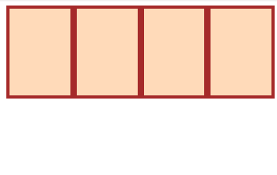
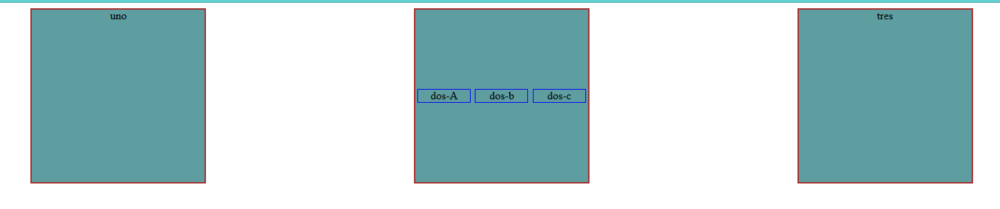

# Flex Box

Flex-box nos permitirá organizar las cajas horizontal y verticalmente.

Veamos este ejemplo:

```HTML
<div class="flex-container">
  <div class="one"></div>
  <div class="two"></div>
  <div class="three"></div>
  <div class="four"></div>
</div>
```

```CSS
.flex-container div {
  background: peachpuff;
  border: 4px solid brown;
  height: 100px;
}
```

En el navegador se observa lo siguiente:


Pero si agregamos la propiedad flex:

```CSS
.flex-container {
  display: flex;
}

/* this selector selects all divs inside of .flex-container */
.flex-container div {
  background: peachpuff;
  border: 4px solid brown;
  height: 100px;
  flex: 1
}
```

Las cajas se ordenarán horizontalmente, y ocuparan todo el ancho disponible.



Existe el contenedor con la propiedad flex, que dentro tiene los denominados items. A la vez una caja puede ser items y contenedor a la vez, por ejemplo:

```HTML
<style>
      .container {
        display: flex;
        text-align: center;
      }
      .hijo {
        width: 250px;
        height: 250px;
        background-color: cadetblue;
        border: 2px solid brown;
        margin: auto;
      }

      .hijo.div-dos {
        display: flex;
      }

      .hijito {
        border: 1px solid blue;
        margin: auto;
        width: 75px;
      }
    </style>
  </head>
  <body>
    <div class="container">
      <div class="hijo">uno</div>
      <div class="hijo div-dos">
        <div class="hijito">dos-A</div>
        <div class="hijito">dos-b</div>
        <div class="hijito">dos-c</div>
      </div>
      <div class="hijo">tres</div>
    </div>
  </body>
</html>
```

El resultado es:



Como se puede ver hay un div contenedor que contiene 3 items acomodados por display flex. Al mismo tiempo la caja del medio es contenedor flex de tres items más.
