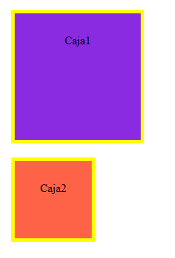
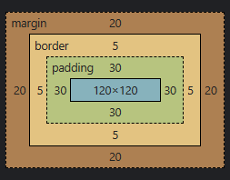
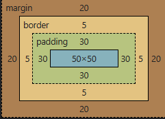

# Box-sizing:

### Hay dos opciones, content-box y border-box. Dependiendo cual usemos cambiará el tamaño final de la caja, teniendo en cuenta el padding y el border. A continuación dejo dos ejemplos, caja1 es content-box, y caja2 border-box



## 1) Box-sizing: content-box:

Esta es la opcion por defecto.
El código css es el siguiente:

```CSS
.caja1 {
        background-color: blueviolet;
        text-align: center;
        border: 5px solid yellow;
        padding: 30px;
        width: 120px;
        height: 120px;
        margin: 20px;
      }
```

El resultado:



_Como se ve en este caso, el tamaño total de la caja contiene en su interior padding y border. La altura es 120 de div + 60 de padding + 10 de border, lo que da un total de 190px. El mismo procedimiento es válido para calcular el ancho que ocupa la caja._

## 2) Box-sizing: border-box:

El código css es el siguiente:

```CSS
.caja2 {
        background-color: tomato;
        text-align: center;
        padding: 30px;
        width: 120px;
        height: 120px;
        border: 5px solid yellow;
        margin: 20px;
        box-sizing: border-box;
      }
```

El resultado:



_En el caso este, se ve claramante como se reduce el tamaño del div para respetar el whith y el height indicado. 120 - 60 - 10 = 50px de caja._

## Como predeterminar border-box en el proyecto:

```CSS
*,
*::after,
*::before {
    box-sizing: border-box;
}
```
